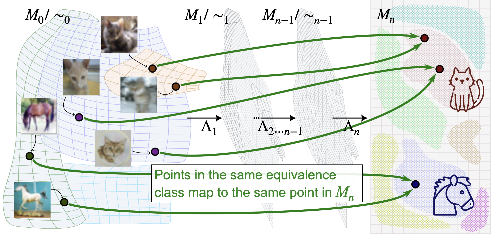
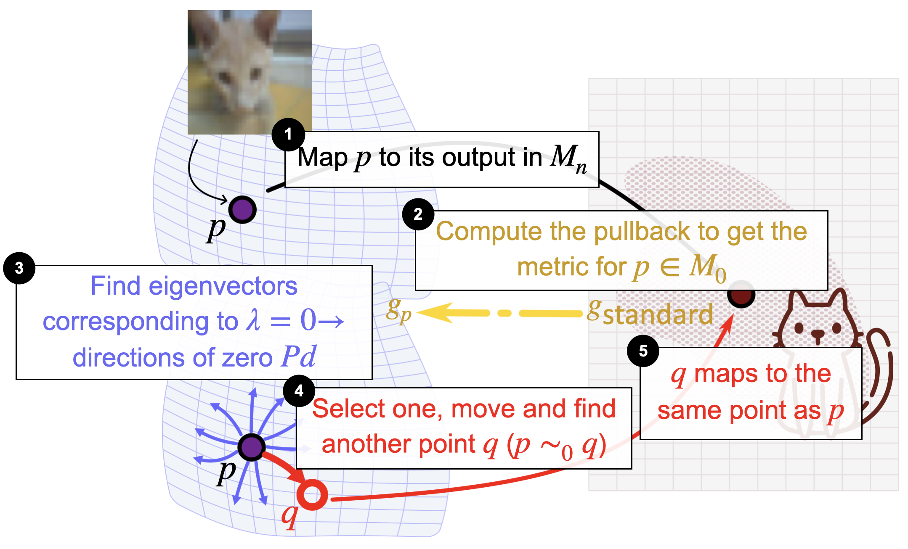
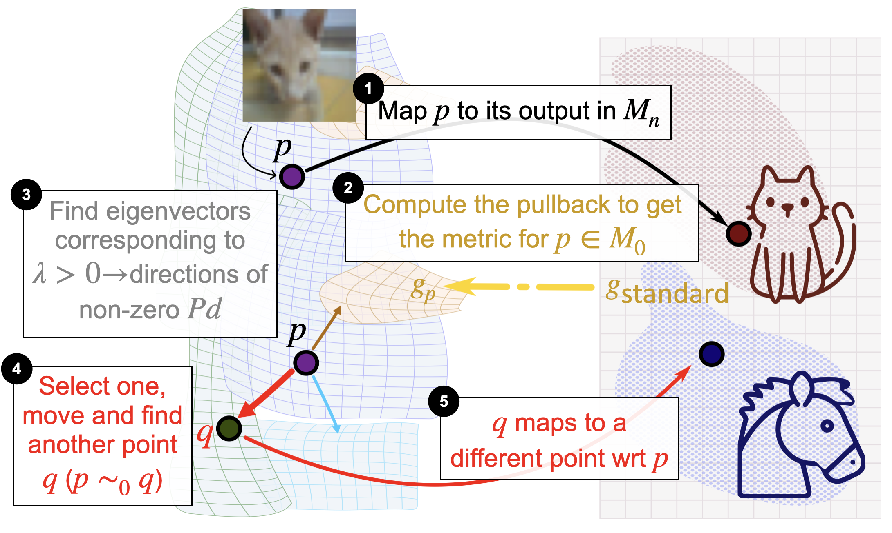

# Unveiling Transformer Perception by Exploring Input Manifolds

[](LICENSE)
[](https://www.python.org/downloads/)
[](https://arxiv.org/abs/2410.06019)

This repository contains the official implementation of the paper [**Unveiling Transformer Perception by Exploring Input Manifolds**](https://arxiv.org/abs/2410.06019).

We introduce a geometric deep learning framework to analyze how Transformers perceive input data. By treating neural networks as sequences of smooth geometric maps, we use **Riemannian geometry** to identify and navigate **equivalence classes**—sets of inputs that the model treats as identical.

## 🧪 Method Overview

Existing interpretation methods often rely on heuristic perturbations. Our approach respects the intrinsic geometric structure of the Transformer's representation space using the **Pullback Metric**.

We propose two algorithms:
1.  **SiMEC (Singular Metric Equivalence Class):** Explores inputs that produce the *same* class probability distribution. It identifies the "neutral" directions where the model perceives zero change.
2.  **SiMExp (Singular Metric Exploration):** Explores inputs that yield a *different* probability distribution, effectively navigating toward distinct equivalence classes (changing the prediction).

<p align="center">
  
  
  
</p>
<p align="center">
  <em><strong>Left:</strong> The input manifold structure. <strong>Middle:</strong> SiMEC navigates within the equivalence class (Zero change). <strong>Right:</strong> SiMExp navigates out of the class (Prediction change).</em>
</p>

# Reproducing experiments

### Prerequisites
*   Python >= 3.10

### Setup
Clone the repository and install the dependencies. We recommend using a virtual environment.

```bash
# 1. Clone the repo
git clone https://github.com/alessiomarta/transformers_equivalence_classes.git
cd transformers_equivalence_classes

# 2. Create and activate virtual environment
python3 -m venv venv
source venv/bin/activate  # On Windows use: venv\Scripts\activate

# 3. Install Python dependencies
pip install --upgrade pip
pip install -r requirements.txt

# 4. Install the local 'simec' package in editable mode
pip install -e simec
```

## 📂 Repository Structure

*   `simec/`: The core python package containing the implementation of Riemannian metric calculations, SiMEC, and SiMExp algorithms.
*   `experiments/`: Scripts to train models (ViT) and configuration files.
*   `analysis/`: Scripts to run the exploration algorithms and analyze results.
*   `dashboard/`: Code for the Streamlit visualization dashboard.
*   `figures/`: Images and plots used in the paper and README.


## 🚀 Usage

**Important:** All commands below assume you are running them from the **root** directory of the repository (`transformers_equivalence_classes/`).

### 1. Train Vision Transformers (ViT)
Before exploring, you need a trained model. You can train a simple ViT on CIFAR-10 or MNIST.

```bash
# Train ViT on CIFAR-10
python3 experiments/models/train_vit.py --config experiments/config/cifar-config.json

# Train ViT on MNIST
python3 experiments/models/train_vit.py --config experiments/config/mnist-config.json
```
*Checkpoints will be saved in the `checkpoints/` directory.*

### 2. Run Input Space Exploration (SiMEC / SiMExp)
Once you have a model, you can run the exploration algorithms. This script performs the Riemannian exploration to generate new embeddings.

```bash
# Example: Explore using the CIFAR-10 model
python3 analysis/vit_exploration.py \
    --model_path checkpoints/best_cifar_model.pth \
    --dataset cifar10 \
    --method simec \
    --steps 1000
```

### 3. Visualize Results (Dashboard)
We provide a dashboard to visualize how the images/text evolve during the exploration and how the class probabilities change.

```bash
streamlit run dashboard/app.py
```

## 📊 Results Summary

Our experiments on **ViT (CIFAR-10, MNIST)** and **BERT (Hate Speech, WinoBias)** show:
*   **SiMEC** consistently retrieves inputs that the model classifies with the exact same probability, confirming the existence of smooth equivalence manifolds.
*   **SiMExp** successfully navigates to decision boundaries, often revealing how subtle changes (invisible to humans) can flip model predictions.
*   Interpretation of these embeddings reveals a "catch-up" effect: the decoded image/text lags behind the internal embedding representation during exploration.

## 📜 Citation

If you use this code or findings in your research, please cite:

```bibtex
@article{benfenati2024unveiling,
  title={Unveiling Transformer Perception by Exploring Input Manifolds},
  author={Benfenati, Alessandro and Ferrara, Alfio and Marta, Alessio and Riva, Davide and Rocchetti, Elisabetta},
  journal={Preprint under review},
  year={2024},
  url={https://arxiv.org/abs/2404.06104}
}
```

## 🤝 Acknowledgments
This work is partially supported by the PNRR-NGEU program under MUR 118/2023.
